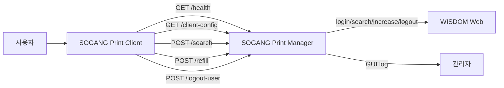

# SOGANG Print Suite

SOGANG Print Suite는 서강대학교 프린터 충전 운영을 위해 만든 Windows용 Manager / Client 프로그램 묶음입니다. 이 문서는 배포용 홍보 문서가 아니라, 코드를 읽거나 유지보수할 사람이 **프로그램의 사용 흐름, 내부 원리, 설정 파일, 빌드/배포 구조**를 함께 이해하기 위한 기술 사용설명서입니다.

- [Manager 기술 사용설명서](manager_app/README.md)
- [Client 기술 사용설명서](client_app/README.md)
- [Deployment 안내](DEPLOYMENT.md)

> [!NOTE]
> 이 문서는 현재 Windows Manager / Client 구조만 설명합니다. 초기 검토 단계에서 태블릿 기반 구조도 논의되었지만, 현재 커밋 대상은 Windows PC용 Manager와 Client입니다.

---

## 1. 프로젝트 목적

프린터 충전 작업에서 가장 중요한 설계 기준은 **사용자 PC에 WISDOM 계정 정보가 남지 않도록 하는 것**입니다. Client는 사용자 입력과 표시만 담당하고, WISDOM 로그인, 검색, 충전, 서버 로그아웃은 모두 Manager가 처리합니다.

이 구조로 인해 다음 책임이 분리됩니다.

| 구분 | 책임 |
|---|---|
| Manager | WISDOM 접속 정보 보관, Client API 제공, 검색/충전/로그아웃 처리, 공지와 프로그램 정보 배포, 운영 로그 표시 |
| Client | 직원번호 입력, Manager API 요청, 결과 표시, 공지와 프로그램 정보 표시 |
| WISDOM | 실제 사용자 조회, 매수 증가, 프린터 서버 로그아웃 처리 |

Client는 충전 가능 여부를 최종 판정하지 않습니다. 버튼 활성화는 사용자 경험을 위한 UI 상태이며, 실제 허용/거부는 Manager의 `/refill` 응답으로 결정됩니다.

---

## 2. 전체 아키텍처



텍스트 흐름으로 보면 다음과 같습니다.

```text
Client 실행
  → client_config.json에서 Manager 주소 로드
  → Manager /health 확인
  → Manager /client-config에서 공지와 Client 프로그램 정보 수신
  → 사용자가 직원번호 검색
  → Manager가 WISDOM 검색 결과를 파싱
  → 사용자가 충전 요청
  → Manager가 WISDOM에서 현재 매수를 재조회한 뒤 필요한 만큼 증가
  → Manager가 최종 재조회와 서버 로그아웃 결과를 reasonCode로 반환
  → Client가 reasonCode를 기준으로 사용자 메시지 표시
```

---

## 3. 스크린샷 위치

아래 스크린샷 파일은 문서에서 먼저 참조합니다. 최초 커밋 시 실제 스크린샷이 준비되지 않았더라도, 같은 경로와 파일명으로 이미지를 추가하면 GitHub README에서 자동 표시됩니다.

### Manager 작동 중 홈 화면


### Client 작동 중 홈 화면


전체 스크린샷 예정 경로는 다음과 같습니다.

```text
docs/images/
  client-home.png
  client-install-server-url.png
  manager-home.png
  manager-initial-setup.png
  manager-about-editor.png
```

---

## 4. WISDOM 연동 방식과 개발 배경

WISDOM은 이 프로그램을 위한 별도 공개 API를 전제로 두지 않습니다. 따라서 Manager는 웹 화면에서 발생하는 HTTP 요청과 HTML 응답을 기준으로 동작합니다.

개발 과정에서는 브라우저 HAR 기록을 분석해 다음 요청 흐름을 확인했습니다.

```text
로그인 요청
  → 직원번호 검색 요청
  → 매수 증가 요청
  → 서버 로그아웃 요청
  → 검색 결과 HTML 재확인
```

이 구조 때문에 Manager는 역할을 둘로 나눕니다.

| 파일 | 역할 |
|---|---|
| `manager_app/app/wisdom_client.py` | WISDOM으로 HTTP 요청을 보냄 |
| `manager_app/app/parser_utils.py` | WISDOM HTML 응답에서 직원번호, 잔여 매수, 서버 로그인 상태를 추출 |

HTML 구조가 바뀌면 가장 먼저 영향을 받는 부분은 `parser_utils.py`입니다. WISDOM URL, 계정, 비밀번호 같은 실제 운영 정보는 README나 GitHub에 포함하지 않습니다.

---

## 5. 설정 파일과 ProgramData 구조

운영 설정은 설치 폴더가 아니라 `ProgramData` 아래에 저장됩니다. 이렇게 하면 앱 재설치 후에도 설정을 유지할 수 있고, 프로그램 파일과 운영 설정을 분리할 수 있습니다.

### Manager

```text
C:\ProgramData\SOGANG Print Manager\
  manager_public_config.json
  manager_secrets.enc.json
  manager_about_content.json
  client_about_content.json
```

| 파일 | 의미 |
|---|---|
| `manager_public_config.json` | Manager host/port, 공지, 관리자 비밀번호 해시 등 공개 설정 |
| `manager_secrets.enc.json` | WISDOM URL, 관리자 ID, 비밀번호를 암호화해 저장 |
| `manager_about_content.json` | Manager의 프로그램 정보 창 내용 |
| `client_about_content.json` | Client에 `/client-config`로 배포할 프로그램 정보 |

### Client

```text
C:\ProgramData\SOGANG Print Client\
  client_config.json
  about_content.json
```

| 파일 | 의미 |
|---|---|
| `client_config.json` | Client가 접속할 Manager 주소 |
| `about_content.json` | Manager 연결 실패 등 fallback 상황에서 사용할 Client 프로그램 정보 기본값 |

---

## 6. 프로그램 정보 JSON 구조

Manager와 Client의 프로그램 정보는 같은 형태의 JSON을 사용합니다.

```json
{
  "app_name": "서강대 프린터 클라이언트 SOGANG Print Client",
  "app_version": "1.0.0",
  "author": "서강대학교 디지털정보처",
  "github_url": "https://github.com/OWNER/REPOSITORY",
  "license_name": "",
  "about_title": "프로그램 정보",
  "about_summary": "프로그램 설명을 입력하세요.",
  "manual_text": "[Client 매뉴얼]\n\n1. 사용 방법을 입력하세요."
}
```

Manager의 관리자 설정 화면에는 `프로그램 정보` 버튼이 있으며, 이 버튼을 통해 Manager 정보와 Client 정보를 함께 편집합니다. 저장 시 Manager는 다음 두 파일을 갱신합니다.

```text
manager_about_content.json
client_about_content.json
```

Client는 이 JSON을 직접 편집하지 않습니다. Client는 Manager의 `/client-config` 응답에 포함된 `aboutContent`를 받아 프로그램 정보 창에 반영합니다.

---

## 7. reasonCode와 message 설계

Manager 응답에는 `reasonCode`와 `message`가 함께 남아 있습니다. 두 필드의 목적은 다릅니다.

| 필드 | 주 용도 |
|---|---|
| `reasonCode` | Client가 사용자 표시 문구를 결정하는 1차 상태 코드 |
| `message` | Manager 로그, 디버깅, 예외 fallback, API 호환을 위한 보조 메시지 |

Client는 Manager가 보낸 긴 한국어 `message` 문자열을 정규식으로 다시 해석하지 않습니다. 대신 `reasonCode`와 수치 필드(`currentCredit`, `beforeCredit`, `afterCredit`, `refillAmount`)를 사용해 사용자 메시지를 만듭니다. 이렇게 하면 Manager 로그 문구가 조금 바뀌어도 Client UI 로직이 깨지지 않습니다.

대표 상태 코드는 다음과 같습니다.

| reasonCode | 의미 |
|---|---|
| `SEARCH_OK_REFILLABLE` | 검색 성공, 충전 가능 |
| `SEARCH_OK_NOT_REFILLABLE` | 검색 성공, 충전 불필요 |
| `REFILL_OK` | 충전 성공 및 로그아웃 완료 |
| `ALREADY_REFILLED_IN_SESSION` | Manager 실행 세션에서 이미 충전함 |
| `REFILL_NOT_NEEDED` | 현재 잔여 매수가 목표값 이상 |
| `LOGOUT_FAILED` | 충전은 반영되었지만 서버 로그아웃 실패 |
| `VERIFY_FAILED` | 충전 후 최종 재확인 실패 |
| `VERIFY_MISMATCH` | 재조회 값이 예상과 다름 |
| `AUTH_ERROR` | WISDOM 인증 실패 |
| `NETWORK_ERROR` | WISDOM 통신 실패 |

---

## 8. 빌드와 배포 개요

빌드/배포 절차는 README 안에 통합합니다. 별도의 상세 `DEPLOYMENT.md`는 안내 링크 문서로 축소했습니다.

전체 빌드 흐름은 다음과 같습니다.

```text
1. Python 가상환경 생성
2. manager_app/requirements.txt, client_app/requirements.txt 설치
3. PyInstaller로 Manager exe 생성
4. PyInstaller로 Client exe 생성
5. Inno Setup으로 Manager 설치 파일 생성
6. Inno Setup으로 Client 설치 파일 생성
7. 운영 PC에 Manager 설치
8. Client 설치 중 Manager IPv4/Port 입력
```

세부 명령과 설치 후 파일 구조는 각 앱 README에 있습니다.

- [Manager 빌드/배포](manager_app/README.md#18-manager-빌드-방법)
- [Client 빌드/배포](client_app/README.md#14-client-빌드-방법)

---

## 9. 앱 아이콘 asset 정책

현재 앱 asset은 각 앱 폴더 아래에 같은 이름으로 들어갑니다.

```text
client_app/assets/app_icon.ico
client_app/assets/app_icon.png
manager_app/assets/app_icon.ico
manager_app/assets/app_icon.png
```

현재 단계에서는 제공된 서강대학교 이미지 파일을 `app_icon.png`로 복사하고, Windows 설치/창 아이콘용 `app_icon.ico`도 같은 이미지를 기준으로 생성해 넣었습니다.

> [!NOTE]
> 다음 정리 작업에서는 `png` 대신 `ico` 하나만 활용하도록 앱 내부 이미지 참조를 통합할 계획입니다. 현재는 Tkinter와 Inno Setup 양쪽 호환을 위해 `ico`와 `png`를 함께 유지합니다.

---

## 10. 최초 GitHub 커밋 포함/제외 기준

### 포함 대상

```text
README.md
DEPLOYMENT.md
.gitignore

client_app/
  README.md
  main.py
  requirements.txt
  Client_setup.iss
  app/
  assets/app_icon.ico
  assets/app_icon.png

manager_app/
  README.md
  main.py
  requirements.txt
  Manager_setup.iss
  app/
  assets/app_icon.ico
  assets/app_icon.png

deploy/
  example_Caddyfile
  example_client_about_content.json
  example_client_config.json
  example_manager_about_content.json
  example_manager_public_config.json
  example_manager_secrets.json.template

tools/
  generate_password_hash.py

docs/images/
  .gitkeep
  client-home.png                 # 추후 추가
  client-install-server-url.png   # 추후 추가
  manager-home.png                # 추후 추가
  manager-initial-setup.png       # 추후 추가
  manager-about-editor.png        # 추후 추가
```

### 제외 대상

```text
__pycache__/
*.pyc
*.pyo
build/
dist/
installer_output/
*.spec
.venv/
venv/
*.log
*.exe

실제 운영 설정 파일:
  client_config.json
  about_content.json
  manager_public_config.json
  manager_secrets.enc.json
  manager_about_content.json
  client_about_content.json
```

예시 JSON과 템플릿은 커밋 대상입니다. 실제 운영 설정과 secrets 파일은 커밋 대상이 아닙니다.

---

## 11. 현재 설계상 한계와 의도

현재 구조는 복잡한 동시성 처리보다 단순하고 예측 가능한 운영을 우선합니다.

| 항목 | 현재 상태 | 의도 |
|---|---|---|
| WISDOM 세션 | 요청마다 새 `WisdomClient`와 `requests.Session` 사용 | 사용량이 낮은 환경에서 세션 공유 문제를 줄임 |
| Client health check | 주기적 health check 없음 | 사용자 동작 시점에 Manager 응답을 다시 확인 |
| `/client-config` | 검색/충전/로그아웃 후 다시 호출 | 공지와 Client 프로그램 정보를 최신화 |
| 중복 충전 방지 | Manager 실행 세션 메모리 기준 | Client 재시작으로는 초기화되지 않지만 Manager 재시작 시 초기화 |
| 동시 요청 Lock | 별도 직렬화 Lock 없음 | 동시 사용 확률이 낮은 운영 환경을 전제로 함 |

위 항목은 현재 코드의 실제 동작입니다. 이후 운영 중 사용량이나 오류 양상이 바뀌면 동시 요청 Lock, WISDOM 세션 재사용, Client 주기 health check 등을 추가할 수 있습니다.
