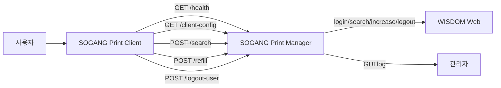

# SOGANG Print Suite

SOGANG Print Suite는 서강대학교 프린터 매수 충전 운영을 위한 Windows용 Manager / Client 프로그램 묶음입니다. Manager는 WISDOM과 직접 통신하고, Client는 사용자 입력과 결과 표시만 담당합니다. WISDOM 접속 정보와 충전 로직은 사용자 PC에 저장하지 않습니다.

## 문서

- [SOGANG Print Manager 기술 사용설명서](manager_app/README.md)
- [SOGANG Print Client 기술 사용설명서](client_app/README.md)

## 구성

| 구성 요소 | 역할 |
|---|---|
| SOGANG Print Manager | WISDOM 접속 정보 관리, Client API 제공, 직원번호 조회, 매수 충전, 프린터 서버 로그아웃, 공지 및 프로그램 정보 배포, 운영 로그 표시 |
| SOGANG Print Client | 직원번호 입력, 조회/충전/서버 로그아웃 요청, 공지사항 표시, 프로그램 정보 표시 |
| WISDOM Web | 실제 사용자 조회, 매수 증가, 프린터 서버 로그아웃 처리 |

## 동작 구조



Client는 `client_config.json`에서 Manager 주소를 읽고 `/health`와 `/client-config`를 호출합니다. 사용자가 직원번호를 조회하면 Client는 `/search`를 호출하고, 충전 요청은 `/refill`로 보냅니다. 프린터 사용 중 중복 로그인 오류가 발생하면 `/logout-user`를 호출합니다. Manager는 WISDOM에 로그인해 조회, 충전, 로그아웃을 처리하고 `reasonCode`와 수치 필드를 Client에 반환합니다.

## 주요 기능

### Manager

- Manager API 서버 실행
- WISDOM URL, 관리자 ID, 비밀번호 저장
- WISDOM secrets 암호화 저장
- Client 요청 처리
- 직원번호 조회
- 잔여 매수 기준 충전량 계산
- 목표 매수 50매까지 충전
- 충전 후 WISDOM 재조회로 반영값 확인
- 프린터 서버 로그아웃 처리
- Client 공지사항 배포
- Manager / Client 프로그램 정보 편집
- 운영 로그 표시
- 홈 화면 종료 버튼과 트레이 종료 메뉴 제공

### Client

- Manager 주소 로드
- Manager 연결 상태 확인
- Manager에서 공지사항과 프로그램 정보 수신
- 직원번호 조회 요청
- 충전 요청
- 프린터 서버 로그아웃 요청
- `reasonCode` 기반 사용자 메시지 표시
- Manager 연결 실패 시 로컬 기본 프로그램 정보 사용
- Windows 시작프로그램 및 바탕화면 바로가기 지원

## API

Manager는 Client용 HTTP API를 제공합니다.

| Method | Route | 목적 |
|---|---|---|
| GET | `/health` | Manager 실행 상태와 설정 완료 여부 확인 |
| GET | `/client-config` | 공지사항, Manager 버전, Client 프로그램 정보 제공 |
| POST | `/search` | 직원번호 조회 |
| POST | `/refill` | 프린터 매수 충전 |
| POST | `/logout-user` | 프린터 서버 세션 로그아웃 |

## 조회 흐름

```text
1. 사용자가 Client에 직원번호를 입력한다.
2. Client가 Manager의 /search로 empId와 pcName을 전송한다.
3. Manager가 WISDOM에 로그인한다.
4. Manager가 WISDOM에서 직원번호를 검색한다.
5. Manager가 HTML 응답에서 잔여 매수와 서버 로그인 상태를 파싱한다.
6. Manager가 충전 가능 여부, 현재 매수, 충전 필요 매수, reasonCode를 반환한다.
7. Client가 reasonCode와 수치 필드로 사용자 메시지를 표시한다.
```

## 충전 흐름

```text
1. 사용자가 Client에서 충전 버튼을 누른다.
2. Client가 Manager의 /refill로 empId와 pcName을 전송한다.
3. Manager가 실행 세션 중복 충전 여부를 확인한다.
4. Manager가 WISDOM에서 현재 잔여 매수를 다시 조회한다.
5. Manager가 목표값 50매와 현재값의 차이를 계산한다.
6. Manager가 필요한 수량만큼 WISDOM 매수 증가 요청을 보낸다.
7. Manager가 WISDOM을 다시 조회해 최종 잔여 매수를 확인한다.
8. Manager가 프린터 서버 로그아웃을 시도한다.
9. Manager가 reasonCode, beforeCredit, afterCredit, refillAmount를 반환한다.
10. Client가 결과 메시지를 표시하고 /client-config를 다시 호출한다.
```

Client 화면의 버튼 상태는 사용자 경험을 위한 보조 표시입니다. 실제 충전 허용 여부와 충전량은 Manager가 충전 요청 시점에 다시 판단합니다.

## 프린터 서버 로그아웃 흐름

```text
1. 사용자가 Client에서 서버 로그아웃 버튼을 누른다.
2. Client가 Manager의 /logout-user로 empId와 pcName을 전송한다.
3. Manager가 WISDOM에 로그인한다.
4. Manager가 해당 직원번호의 서버 로그아웃 요청을 보낸다.
5. Manager가 WISDOM 검색 결과로 로그아웃 상태를 확인한다.
6. Client가 reasonCode 기준으로 결과 메시지를 표시한다.
```

## reasonCode

Client는 Manager의 긴 `message` 문장을 정규식으로 해석하지 않습니다. 사용자 표시 문구는 `reasonCode`와 수치 필드를 기준으로 만듭니다.

| reasonCode | 의미 |
|---|---|
| `SEARCH_OK_REFILLABLE` | 조회 성공, 충전 가능 |
| `SEARCH_OK_NOT_REFILLABLE` | 조회 성공, 충전 불필요 |
| `REFILL_OK` | 충전 반영, 최종 재조회 일치, 서버 로그아웃 완료 |
| `ALREADY_REFILLED_IN_SESSION` | Manager 실행 세션에서 이미 충전한 사용자 |
| `REFILL_NOT_NEEDED` | 잔여 매수가 목표값 이상 |
| `LOGOUT_OK` | 프린터 서버 로그아웃 확인 |
| `LOGOUT_FAILED` | 충전은 반영되었지만 서버 로그아웃 실패 |
| `LOGOUT_VERIFY_FAILED` | 서버 로그아웃 요청 후 종료 상태 확인 실패 |
| `VERIFY_FAILED` | 충전 후 최종 재확인 실패 |
| `VERIFY_MISMATCH` | 충전 후 재조회 값이 예상과 다름 |
| `AUTH_ERROR` | WISDOM 인증 실패 |
| `NETWORK_ERROR` | WISDOM 통신 실패 |
| `NOT_FOUND` | 직원번호 검색 결과 없음 |
| `PARSE_FAILED` | WISDOM HTML 응답 파싱 실패 |
| `INVALID_INPUT` | 요청 입력값 오류 |

## 설정 파일

운영 설정은 설치 폴더가 아니라 `ProgramData` 아래에 저장됩니다.

### Manager

```text
C:\ProgramData\SOGANG Print Manager\
  manager_public_config.json
  manager_secrets.enc.json
  manager_about_content.json
  client_about_content.json
```

| 파일 | 설명 |
|---|---|
| `manager_public_config.json` | Manager host/port, 공지사항, 관리자 비밀번호 해시 |
| `manager_secrets.enc.json` | WISDOM URL, WISDOM 관리자 ID, WISDOM 관리자 비밀번호를 암호화해 저장 |
| `manager_about_content.json` | Manager 프로그램 정보 창 내용 |
| `client_about_content.json` | Client에 `/client-config`로 배포할 프로그램 정보 |

### Client

```text
C:\ProgramData\SOGANG Print Client\
  client_config.json
  about_content.json
```

| 파일 | 설명 |
|---|---|
| `client_config.json` | Client가 접속할 Manager 주소 |
| `about_content.json` | Manager 연결 실패 시 사용할 Client 프로그램 정보 기본값 |

## 프로그램 정보

Manager와 Client의 프로그램 정보는 같은 JSON 구조를 사용합니다.

```json
{
  "app_name": "서강대 프린터 클라이언트 SOGANG Print Client",
  "app_version": "1.0.0",
  "author": "서강대학교 디지털정보처",
  "github_url": "https://github.com/MiRiNaeJM/sogang-print-suite",
  "license_name": "",
  "about_title": "프로그램 정보",
  "about_summary": "프로그램 요약 설명",
  "manual_text": "프로그램 사용 안내"
}
```

Manager의 관리자 설정 화면에는 `프로그램 정보` 버튼이 있습니다. 이 버튼은 Manager용 정보와 Client용 정보를 함께 편집하는 창을 엽니다. 저장 시 `manager_about_content.json`과 `client_about_content.json`이 갱신됩니다. Client는 `/client-config` 응답의 `aboutContent`를 받아 프로그램 정보 창에 반영합니다.

## 공지사항

공지사항은 `manager_public_config.json`의 `announcement` 값으로 저장됩니다. Manager는 `/client-config` 응답으로 이 값을 Client에 배포합니다. Client는 앱 시작, 조회, 충전, 서버 로그아웃, 설정 갱신 흐름에서 `/client-config`를 호출해 공지사항과 프로그램 정보를 갱신합니다.

## WISDOM 연동

WISDOM은 별도 공개 API가 아니라 웹 요청과 HTML 응답을 기준으로 연동됩니다. Manager는 브라우저 요청 흐름과 동일하게 로그인, 직원번호 검색, 매수 증가, 프린터 서버 로그아웃 요청을 보냅니다.

| 파일 | 역할 |
|---|---|
| `manager_app/app/wisdom_client.py` | WISDOM HTTP 요청 처리 |
| `manager_app/app/parser_utils.py` | WISDOM HTML 응답에서 직원번호, 잔여 매수, 서버 로그인 상태 파싱 |
| `manager_app/app/app_service.py` | 검색, 충전, 로그아웃 업무 로직 |
| `manager_app/app/server_app.py` | Flask route와 ManagerService 연결 |

WISDOM URL, 관리자 ID, 관리자 비밀번호는 README와 GitHub 저장소에 포함하지 않습니다.

## 아이콘과 리소스

Manager와 Client는 루트의 공유 아이콘을 사용합니다.

```text
assets/app_icon.ico
```

PyInstaller spec 파일은 루트 `assets` 폴더를 실행 파일 배포본의 `assets` 폴더로 포함합니다. Manager와 Client의 `resource_utils.py`는 개발 환경과 PyInstaller 실행 환경에서 `assets/app_icon.ico`를 찾습니다. Tkinter 라벨에 표시할 아이콘 이미지는 Pillow로 ICO 파일을 읽어 `ImageTk.PhotoImage`로 변환합니다. Inno Setup 설치 스크립트도 루트 `assets/app_icon.ico`를 설치 아이콘과 앱 리소스로 사용합니다.

## 빌드 요구사항

- Windows
- Python 3
- PyInstaller
- Inno Setup
- Manager Python 패키지
  - Flask
  - Waitress
  - Requests
  - BeautifulSoup4
  - Cryptography
  - pywin32
  - pystray
  - Pillow
- Client Python 패키지
  - Requests
  - Pillow
  - PyInstaller

## 빌드

프로젝트 루트에서 가상환경을 준비합니다.

```powershell
python -m venv .venv
.\.venv\Scripts\activate
python -m pip install --upgrade pip
pip install -r manager_app\requirements.txt
pip install -r client_app\requirements.txt
```

Manager 실행 파일을 생성합니다.

```powershell
python -m PyInstaller --noconfirm `
  --distpath "dist" `
  --workpath "build\manager" `
  "SOGANG_Print_Manager.spec"
```

Client 실행 파일을 생성합니다.

```powershell
python -m PyInstaller --noconfirm `
  --distpath "dist" `
  --workpath "build\client" `
  "SOGANG_Print_Client.spec"
```

빌드 결과물은 루트 `dist` 폴더에 생성됩니다.

```text
dist\
  SOGANG Print Manager\
  SOGANG Print Client\
```

## 설치 파일 생성

Manager 설치 파일은 `manager_app/Manager_setup.iss`로 생성합니다.

```powershell
cd manager_app
ISCC Manager_setup.iss
```

Client 설치 파일은 `client_app/Client_setup.iss`로 생성합니다.

```powershell
cd client_app
ISCC Client_setup.iss
```

설치 파일은 각 앱의 `installer_output` 폴더에 생성됩니다.

## 설치 스크립트 동작

### Manager 설치

- `dist\SOGANG Print Manager` 배포본을 설치 폴더에 복사
- `assets/app_icon.ico`를 설치 폴더의 `assets`로 복사
- `deploy/example_manager_about_content.json`을 `manager_about_content.json`으로 ProgramData에 복사
- `deploy/example_client_about_content.json`을 `client_about_content.json`으로 ProgramData에 복사
- `C:\ProgramData\SOGANG Print Manager` 폴더 권한 설정
- 시작 메뉴, 바탕화면, 시작프로그램 바로가기 생성
- 기존 Manager 설정 초기화 옵션 제공

### Client 설치

- `dist\SOGANG Print Client` 배포본을 설치 폴더에 복사
- `assets/app_icon.ico`를 설치 폴더의 `assets`로 복사
- `deploy/example_client_about_content.json`을 `about_content.json`으로 ProgramData에 복사
- `C:\ProgramData\SOGANG Print Client` 폴더 권한 설정
- Manager IPv4 주소와 포트 입력 화면 제공
- 입력값으로 `client_config.json` 생성
- 시작 메뉴, 바탕화면, 시작프로그램 바로가기 생성
- 기존 Client 설정 초기화 옵션 제공

## 저장소 파일 구조

```text
SOGANG Print Suite
├─ README.md
├─ SOGANG_Print_Manager.spec
├─ SOGANG_Print_Client.spec
├─ assets/
│  └─ app_icon.ico
├─ client_app/
│  ├─ README.md
│  ├─ main.py
│  ├─ requirements.txt
│  ├─ Client_setup.iss
│  └─ app/
├─ manager_app/
│  ├─ README.md
│  ├─ main.py
│  ├─ requirements.txt
│  ├─ Manager_setup.iss
│  └─ app/
├─ deploy/
│  ├─ example_Caddyfile
│  ├─ example_client_about_content.json
│  ├─ example_client_config.json
│  ├─ example_manager_about_content.json
│  ├─ example_manager_public_config.json
│  └─ example_manager_secrets.json.template
├─ docs/
│  └─ images/
└─ tools/
   └─ generate_password_hash.py
```

## 커밋 제외 대상

다음 파일과 폴더는 저장소에 커밋하지 않습니다.

```text
__pycache__/
*.pyc
*.pyo
build/
dist/
installer_output/
.venv/
venv/
*.log
*.exe

실제 운영 설정 파일:
  client_config.json
  about_content.json
  manager_public_config.json
  manager_secrets.enc.json
  manager_about_content.json
  client_about_content.json
```

예시 JSON과 템플릿은 저장소에 포함합니다. 실제 운영 secrets와 ProgramData 설정 파일은 저장소에 포함하지 않습니다.
