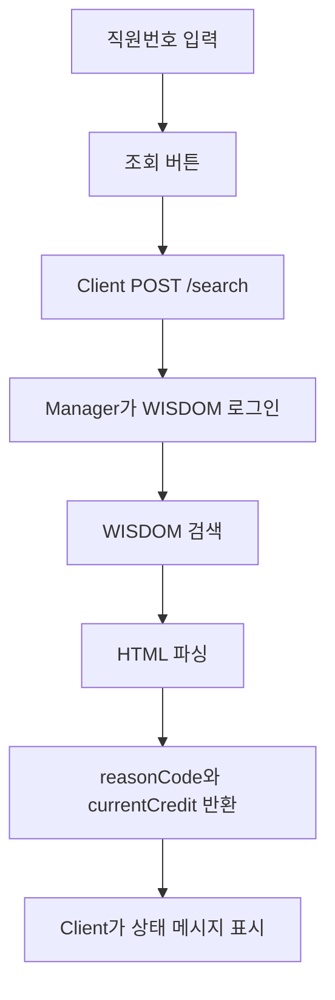

# SOGANG Print Client 기술 사용설명서

SOGANG Print Client는 사용자 PC에서 직원번호를 입력하고 Manager에 검색/충전/로그아웃 요청을 보내는 Windows GUI 프로그램입니다. Client는 WISDOM과 직접 통신하지 않으며, WISDOM 계정 정보나 충전 알고리즘도 보관하지 않습니다.

- [프로젝트 전체 README](../README.md)
- [Manager 기술 사용설명서](../manager_app/README.md)

---

## 1. Client의 목적

Client의 목적은 사용자에게 단순한 입력/표시 화면을 제공하고, 모든 실제 처리를 Manager에 위임하는 것입니다.

Client가 하는 일은 다음입니다.

| 항목 | 설명 |
|---|---|
| Manager 주소 로드 | `client_config.json`에서 `manager_base_url` 읽기 |
| Manager 상태 확인 | `/health` 요청으로 Manager 실행 여부 확인 |
| 공지/프로그램 정보 수신 | `/client-config`에서 announcement와 aboutContent 수신 |
| 직원번호 검색 | `/search` 요청 전송 |
| 충전 요청 | `/refill` 요청 전송 |
| 서버 로그아웃 요청 | `/logout-user` 요청 전송 |
| 사용자 메시지 표시 | Manager의 `reasonCode`와 수치 필드 기준으로 한영 메시지 표시 |

Client가 하지 않는 일은 다음입니다.

```text
- WISDOM에 직접 로그인하지 않는다.
- WISDOM 계정 정보를 저장하지 않는다.
- 최종 충전 가능 여부를 직접 확정하지 않는다.
- Manager의 긴 message 문장을 정규식으로 해석하지 않는다.
- 관리자 설정을 앱 내부에서 저장하지 않는다.
```

---

## 2. 화면 구성


Client 홈 화면은 사용자가 직원번호를 입력하고 검색/충전/서버 로그아웃을 요청하는 화면입니다.

| 요소 | 역할 |
|---|---|
| 공지사항 영역 | Manager의 `/client-config`에서 받은 announcement 표시 |
| 직원번호 입력칸 | 검색/충전/로그아웃 대상 직원번호 입력 |
| 조회 버튼 | Manager `/search` 호출 |
| 충전 버튼 | Manager `/refill` 호출. 실제 허용 여부는 Manager가 결정 |
| 서버 로그아웃 버튼 | Manager `/logout-user` 호출 |
| 상태 메시지 | reasonCode 기반 한국어/영어 안내 표시 |
| 프로그램 정보 | Manager에서 내려준 aboutContent 또는 로컬 기본 정보 표시 |

버튼 활성화는 사용성을 위한 보조 상태입니다. 예를 들어 검색 결과에서 충전 가능으로 보이더라도, 충전 버튼을 눌렀을 때 Manager가 다시 WISDOM에서 현재 값을 조회하고 최종 판단합니다.

---

## 3. 설치 중 Manager 주소 입력 화면


Client 설치 프로그램은 설치 중 Manager IPv4 주소와 포트를 입력받습니다.

설치 스크립트는 다음 형식의 설정 파일을 만듭니다.

```json
{
  "manager_base_url": "http://192.168.0.25:8787"
}
```

저장 위치는 다음입니다.

```text
C:\ProgramData\SOGANG Print Client\client_config.json
```

설치 페이지는 숫자 IPv4와 포트 범위를 검증합니다. `http://`는 사용자가 입력하지 않고 설치 스크립트가 자동으로 붙입니다.

---

## 4. 실행 시 초기화 흐름

Client 실행 흐름은 다음과 같습니다.

```text
main.py
  → launch_client_gui()
  → ClientConfigStore.load()
  → ClientContext.from_current_machine()
  → ManagerApi 생성
  → Manager /health 확인
  → Manager /client-config 요청
  → 공지사항 표시
  → aboutContent를 프로그램 정보 창에 반영
```

Manager 연결에 실패하면 Client는 로컬 기본 프로그램 정보와 기본 공지 상태로 시작합니다. 이 경우 검색/충전은 정상적으로 진행되지 않고, 사용자는 Manager 연결 오류 메시지를 보게 됩니다.

---

## 5. Manager 연결 흐름

Client는 `client_config.json`의 `manager_base_url`을 기준으로 API URL을 만듭니다.

```text
manager_base_url = http://192.168.0.25:8787

GET  http://192.168.0.25:8787/health
GET  http://192.168.0.25:8787/client-config
POST http://192.168.0.25:8787/search
POST http://192.168.0.25:8787/refill
POST http://192.168.0.25:8787/logout-user
```

Client는 주기적 health check를 별도로 실행하지 않습니다. 대신 앱 시작, 검색, 충전, 로그아웃 같은 사용자 동작 시점에 Manager 응답을 확인합니다.

---

## 6. 직원번호 검색 흐름



검색 흐름의 세부 단계는 다음입니다.

```text
1. 사용자가 직원번호를 입력한다.
2. Client가 pcName과 empId를 Manager에 보낸다.
3. Manager가 WISDOM에 로그인한다.
4. Manager가 WISDOM에서 직원번호를 검색한다.
5. Manager가 HTML 응답에서 현재 매수와 서버 로그인 상태를 파싱한다.
6. Manager가 reasonCode, currentCredit, refillAmount, canRefill을 반환한다.
7. Client가 reasonCode와 숫자 필드로 사용자 메시지를 만든다.
```

검색 성공 reasonCode는 다음입니다.

| reasonCode | Client 표시 의미 |
|---|---|
| `SEARCH_OK_REFILLABLE` | 조회됨, 현재 잔여 매수와 충전 후 목표값 표시 |
| `SEARCH_OK_NOT_REFILLABLE` | 조회됨, 충전이 필요하지 않음 |
| `ALREADY_REFILLED_IN_SESSION` | 조회됨, 하지만 Manager 실행 세션에서 이미 충전함 |

---

## 7. 충전 흐름

충전은 검색 결과를 바탕으로 시작하지만, 실제 충전 가능 여부는 Manager가 다시 판단합니다.

```text
1. 사용자가 충전 버튼을 누른다.
2. Client가 /refill 요청을 보낸다.
3. Manager가 운영 세션 중복 충전 여부를 확인한다.
4. Manager가 WISDOM에서 현재 매수를 다시 조회한다.
5. Manager가 목표값 50매와 현재값의 차이를 계산한다.
6. Manager가 WISDOM increase 요청을 보낸다.
7. Manager가 다시 조회해 실제 반영값을 확인한다.
8. Manager가 서버 로그아웃을 시도한다.
9. Client는 reasonCode 기준으로 결과 메시지를 표시한다.
10. Client는 /client-config를 다시 불러와 공지와 프로그램 정보를 갱신한다.
```

Client가 충전량을 계산하지 않는 이유는 검색 후 실제 충전 전까지 WISDOM 상태가 바뀔 수 있기 때문입니다.

대표 표시 결과는 다음입니다.

| reasonCode | 사용자에게 보이는 의미 |
|---|---|
| `REFILL_OK` | 충전 완료, 전/후 매수 표시 |
| `REFILL_NOT_NEEDED` | 현재 잔여 매수가 충분해 충전 불필요 |
| `ALREADY_REFILLED_IN_SESSION` | 이미 이번 운영 세션에서 충전함 |
| `LOGOUT_FAILED` | 충전은 반영되었지만 서버 로그아웃 실패 |
| `VERIFY_FAILED` | 충전 후 최종 재확인 실패 |
| `VERIFY_MISMATCH` | 재조회 값이 예상과 다름 |

---

## 8. 서버 로그아웃 흐름

서버 로그아웃은 WISDOM 프린터 서버 세션을 종료하기 위한 기능입니다.

```text
1. 사용자가 서버 로그아웃 버튼을 누른다.
2. Client가 /logout-user 요청을 보낸다.
3. Manager가 WISDOM에 로그인한다.
4. Manager가 해당 직원번호의 서버 로그아웃 요청을 보낸다.
5. Manager가 로그아웃 상태를 재확인한다.
6. Client가 결과를 표시한다.
```

대표 reasonCode는 다음입니다.

| reasonCode | 의미 |
|---|---|
| `LOGOUT_OK` | 프린터 서버 세션 종료 확인 |
| `LOGOUT_VERIFY_FAILED` | 서버 세션 종료를 확인하지 못함 |
| `LOGOUT_ERROR` | 로그아웃 처리 중 문제 발생 |

---

## 9. `/client-config` 갱신 흐름

Client는 다음 시점에 `/client-config`를 호출합니다.

```text
- 앱 시작 후 Manager 설정 갱신
- 검색 후
- 충전 후
- 서버 로그아웃 후
```

이 호출은 단순 공지 갱신만이 아닙니다. `/client-config`에는 다음 값이 들어 있습니다.

```json
{
  "ok": true,
  "announcement": "공지사항 내용",
  "managerVersion": "1.0.0",
  "aboutContent": {
    "app_name": "서강대 프린터 클라이언트 SOGANG Print Client",
    "app_version": "1.0.0",
    "author": "서강대학교 디지털정보처",
    "github_url": "https://github.com/OWNER/REPOSITORY",
    "license_name": "",
    "about_title": "프로그램 정보",
    "about_summary": "클라이언트 프로그램 설명",
    "manual_text": "사용 안내"
  }
}
```

따라서 함수 이름도 `_refresh_client_config()`로 정리되어 있습니다. 이 함수는 공지와 프로그램 정보를 함께 갱신합니다.

---

## 10. 프로그램 정보 표시 방식

Client 프로그램 정보 창은 다음 순서로 내용을 결정합니다.

```text
1. 기본값: client_app/app/about_content.py
2. 로컬 파일: C:\ProgramData\SOGANG Print Client\about_content.json
3. Manager 응답: /client-config의 aboutContent
```

Manager와 연결되면 Manager가 내려준 `aboutContent`가 우선 반영됩니다. 이 구조 때문에 Client 프로그램 정보는 사용자 PC에서 직접 편집하지 않고, Manager에서 중앙 관리할 수 있습니다.

---

## 11. reasonCode 기반 메시지 표시

Client의 `i18n.py`는 Manager가 보낸 긴 `message` 문장을 해석하지 않습니다. 대신 `reasonCode`와 숫자 필드를 기준으로 한국어/영어 문구를 만듭니다.

예를 들어 Manager가 다음 값을 반환하면:

```json
{
  "reasonCode": "REFILL_OK",
  "beforeCredit": 12,
  "afterCredit": 50,
  "refillAmount": 38
}
```

Client는 다음과 같은 문구를 만듭니다.

```text
충전되었습니다
12매 → 50매

Refill completed
12 to 50
```

`message`는 알 수 없는 reasonCode나 예외 fallback 상황에서만 보조적으로 사용합니다.

---

## 12. 오류 상황별 사용자 표시

| 상황 | 대표 reasonCode | 사용자 표시 의미 | 확인할 위치 |
|---|---|---|---|
| Manager 주소 없음 | 없음 | Manager 주소가 설정되지 않음 | `client_config.json` |
| Manager 연결 실패 | 없음 | Manager에 연결할 수 없음 | Manager 실행 여부, 방화벽, IP/Port |
| 직원번호 미입력 | `INVALID_INPUT` | 학번/사번 입력 필요 | Client 입력값 |
| 직원번호 없음 | `NOT_FOUND` | 조회 결과 없음 | WISDOM 데이터 |
| 현재 매수 파싱 실패 | `PARSE_FAILED` | WISDOM HTML 구조 확인 필요 | `parser_utils.py` |
| 이미 충전함 | `ALREADY_REFILLED_IN_SESSION` | Manager 실행 세션에서 이미 충전 | Manager 재시작 여부 |
| 충전 불필요 | `REFILL_NOT_NEEDED` | 이미 목표 매수 이상 | WISDOM 현재 매수 |
| 인증 실패 | `AUTH_ERROR` | WISDOM 로그인 실패 | Manager secrets |
| 통신 실패 | `NETWORK_ERROR` | WISDOM 통신 실패 | 네트워크, WISDOM 상태 |
| 재조회 불일치 | `VERIFY_MISMATCH` | 충전 후 값이 예상과 다름 | Manager 로그, WISDOM 실제 값 |

---

## 13. Client가 의도적으로 하지 않는 일

Client는 보안과 관리 단순화를 위해 다음 기능을 갖지 않습니다.

```text
- WISDOM URL/ID/PW 입력 기능
- WISDOM 직접 통신
- 관리자 설정 저장 기능
- 충전량 직접 계산
- 운영 세션 충전 기록 보관
- 주기적 health check
```

Client를 재시작해도 Manager가 가진 운영 세션 충전 기록은 초기화되지 않습니다. 반대로 Manager를 재시작하면 운영 세션 기록은 초기화됩니다.

---

## 14. Client 빌드 방법

개발 PC에서 Client 실행 파일을 만들 때는 `client_app` 폴더에서 작업합니다.

```powershell
cd client_app
python -m venv .venv
.\.venv\Scripts\activate
python -m pip install --upgrade pip
pip install -r requirements.txt
```

PyInstaller 예시:

```powershell
pyinstaller --noconfirm --windowed --onedir `
  --name "SOGANG Print Client" `
  --icon "assets\app_icon.ico" `
  --add-data "assets;assets" `
  main.py
```

이 명령의 결과물은 `client_app/dist/SOGANG Print Client/` 아래에 생깁니다. `Client_setup.iss`의 `MySourceDir`도 이 경로를 기준으로 합니다.

---

## 15. Inno Setup 설치 파일 생성

Client 설치 파일은 `Client_setup.iss`로 생성합니다.

```powershell
cd client_app
ISCC Client_setup.iss
```

설치 스크립트의 주요 동작은 다음입니다.

| 섹션 | 동작 |
|---|---|
| `[Files]` | PyInstaller 결과물, 아이콘, 기본 프로그램 정보 JSON 복사 |
| `[Dirs]` | `C:\ProgramData\SOGANG Print Client` 폴더 생성 및 권한 설정 |
| `[Icons]` | 시작 메뉴, 바탕화면, 시작프로그램 바로가기 생성 |
| `[Code]` | Manager IPv4/Port 입력, 기존 설정 초기화 옵션 처리 |

설치 파일은 `client_app/installer_output/` 아래에 생성됩니다. 이 폴더는 GitHub 커밋 대상이 아닙니다.

---

## 16. 설치 후 ProgramData 파일

Client 설치 후 사용되는 파일은 다음입니다.

```text
C:\ProgramData\SOGANG Print Client\
  client_config.json
  about_content.json
```

`client_config.json`은 설치 중 입력한 Manager 주소로 만들어집니다.

```json
{
  "manager_base_url": "http://192.168.0.25:8787"
}
```

`about_content.json`은 Manager에 연결하지 못할 때 사용할 기본 프로그램 정보입니다. 정상 운영에서는 Manager의 `/client-config`에 포함된 `aboutContent`가 우선 반영됩니다.

---

## 17. 운영 PC 배치 기준

Client 운영 PC에는 다음이 필요합니다.

```text
- 설치된 SOGANG Print Client 프로그램
- C:\ProgramData\SOGANG Print Client\client_config.json
- Manager PC로 접속 가능한 네트워크
- Manager 서버 포트 접근 허용
```

Client는 시작프로그램 바로가기를 생성하므로 Windows 부팅 후 자동 실행될 수 있습니다. 사용자가 실수로 종료했을 때를 대비해 바탕화면 바로가기도 생성합니다.

---

## 18. 앱 아이콘 asset

Client는 현재 다음 asset을 사용합니다.

```text
client_app/assets/app_icon.ico
client_app/assets/app_icon.png
```

현재 단계에서는 제공된 서강대학교 이미지 파일을 `app_icon.png`로 복사하고, 같은 이미지를 기준으로 `app_icon.ico`를 생성했습니다. 다음 정리에서는 앱 내부 이미지 참조를 `.ico` 하나로 통합해 `png` 의존을 줄일 계획입니다.

---

## 19. 주요 코드 파일 설명

| 파일 | 역할 |
|---|---|
| `main.py` | Client 실행 진입점 |
| `app/gui_client.py` | Client 메인 GUI, 검색/충전/로그아웃 버튼 흐름 |
| `app/manager_api.py` | Manager HTTP API 호출 래퍼 |
| `app/api_models.py` | Manager 응답 dataclass 모델 |
| `app/i18n.py` | reasonCode 기반 사용자 메시지 생성 |
| `app/config_store.py` | `client_config.json` 로드 |
| `app/client_context.py` | PC 이름/사용자 이름 등 운영 로그용 Client 정보 생성 |
| `app/about_content.py` | Client 프로그램 정보 기본값 |
| `app/about_content_loader.py` | 로컬/Manager aboutContent 정규화 |
| `app/about_dialog.py` | 프로그램 정보 창 |
| `app/paths.py` | ProgramData 경로 계산 |
| `app/resource_utils.py` | 아이콘 asset 로드 |
| `app/ui_style.py` | Tkinter 스타일 정의 |
